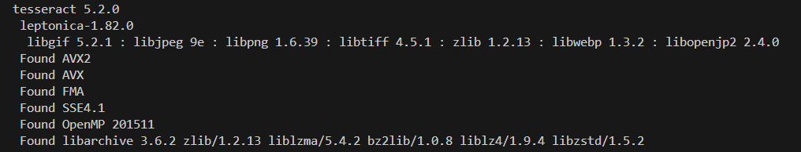
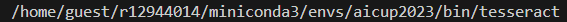

# AI CUP 2024 玉山人工智慧公開挑戰賽 － RAG與LLM在金融問答的應用

## 競賽說明
「當 LLM 開創了人人使用 AI 的時代，你準備好了嗎？」
在大型語言模型加速催化各式技術的年代，語言模型的開發週期越來越短、效能越來越強。隨著大型語言模型的問世，金融業龐大且複雜的資料已經不再是語料檢索無法高度泛化的障礙，而是逐漸被解決的問題。
本屆挑戰賽聚焦在金融問答領域，提供豐富的資料庫供參賽者使用。參賽者需設計機制以提高檢索結果的準確性，包括從提供的語料中找出完整回答問題的正確資料等基本要求，以及應用大型語言模型的生成能力，產出正確且完整的回答。
準備好了的話，現在就報名參加挑戰吧！

## 競賽時程
- 2024/10/30 公布複賽 Baseline 說明、複賽提交結果檔範例以及複賽雲端資源規格、複賽簡報模板
- 2024/11/09 初賽 
- 2024/11/11 通過初賽的隊伍繳交實作程式及指定說明文件
- 2024/11/15 公布複賽名單
- 2024/11/22 繳交複賽出席隊員名單
- 2024/12/07 複賽 (實體)

## 相關連結
- [T-Brain 官網](https://tbrain.trendmicro.com.tw/Competitions/Details/37)
- [AI CUP 官網](https://www.aicup.tw/ai-cup-2024-competition)

## 代辦任務
### 任務s
- 資料前處理
    - **針對 PDF 的 圖片 和 表格 進行處理**
    - **Summary**
    - 產生更多的 queries/找其他金融相關的資料集
    - 去 noise
- 針對 Retrieve 方式改用其他方式 
    - 不 Fine-tune: **套 Pre-train Models 去分析表現**
        - cross model
        - two tower model
        - 要是支援中文的 Model
        - 翻譯?
    - Fine-tune e.g. 可能可以參考 [huggingface multiple choice](https://github.com/huggingface/transformers/blob/main/examples/pytorch/multiple-choice/run_swag_no_trainer.py)
        - 找其他金融相關的資料集去 Fine-tune
- Semantic ID ? 

### 2024/10/25
#### QQ
- **針對 PDF 的 圖片 和 表格 進行處理**
- **Summary**
#### Liam
- 不 Fine-tune: **套 Pre-train Models 去分析表現**

### 2024/11/1
#### QQ
- Summary token limit 問題

#### Lian
- 看看 finance 9 個怎麼了
- Image 解決 (OCR) (可能要先把 PDF轉成圖片檔)

## 工作時程
- 2024/10/18(五) 實作與訓練 Baseline Model，討論或 Survey 如何提出進步，有沒有什麼方法可以嘗試？
- 2024/10/20(日) 完成 Baseline Model Training
- 2024/10/21(一) 討論 Baseline Model 的結果以及進步方法
- 2024/10/25(五) 進步方法完成並嘗試結果，討論下一步
- 2024/11/06(三) 討論
- 2024/11/09 參加初賽，繳交結果到系統 (only 3 次機會)

## 安裝
#### 注意：要在 Python 3 的環境
```
pip install -r requirements.txt
```

#### 安裝 Pytorch
```
> conda install pytorch torchvision torchaudio pytorch-cuda=11.8 -c pytorch -c nvidia
> conda install conda-forge::transformers
> pip install sentencepiece
> pip install tokenizers
> pip install protobuf
```

## [先不要安裝，會有衝突，待解決]
#### 安裝圖片轉文字套件
```
> conda install -c conda-forge tesseract pytesseract

> wget https://github.com/tesseract-ocr/tessdata_best/blob/main/chi_tra.traineddata

> mv chi_tra.traineddata $(conda info --base)/envs/{your_condaEnvName}/share/tessdata/
```
檢查
```
tesseract -v
```


```
which tesseract
```
